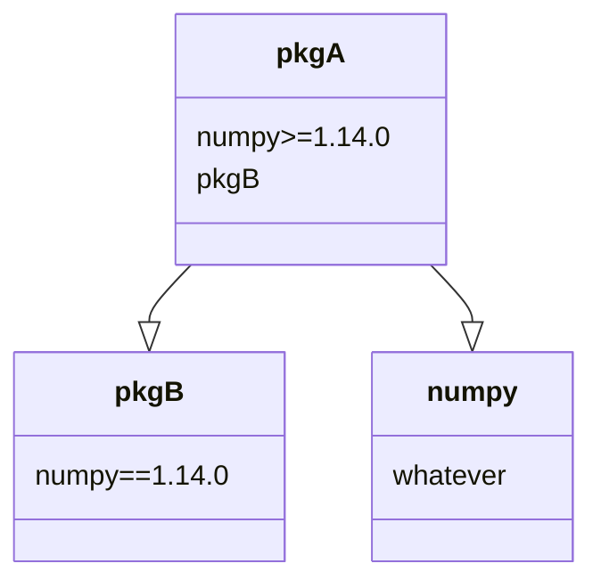

# Didactic library

This should install `numpy==1.14.0` but it doesn't:




```bash
conda create -n tst2 python=3.6 pip=18 -y
conda activate tst2

git clone https://github.com/KikeM/pkgA.git
git clone https://github.com/mmngreco/pkgB.git

cat pkgA/setup.py
cat pkgB/setup.py

pip install pkgA/. --process-dependency-links -I --no-cache-dir
pip freeze | grep numpy  # numpy==1.17.1 ??
```

This should **crash** installation process but it doesn't with incompatible versions of numpy.


```bash
cd pkgA
git checkout crash  # pkgA

cd ../pkgB
git checkout crash  # pkgB
cd ..

cat pkgA/setup.py
cat pkgB/setup.py

pip install pkgA/. --process-dependency-links -I --no-cache-dir
pip freeze | grep numpy  # numpy==1.17.1
```

